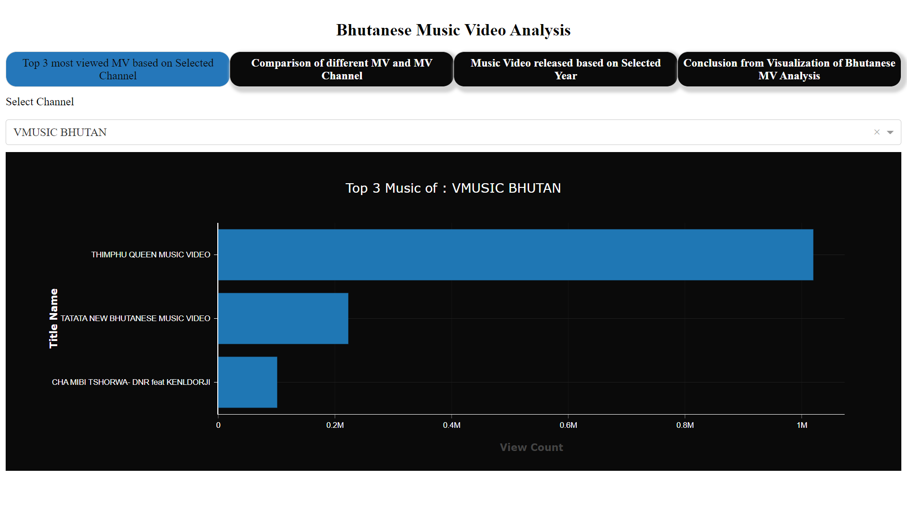
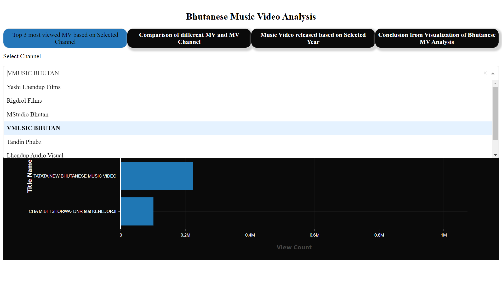
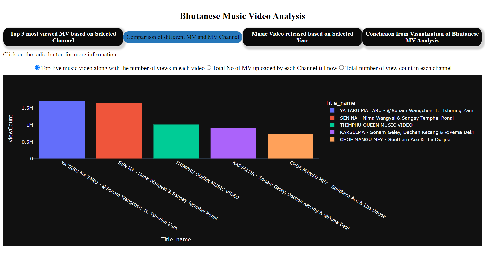
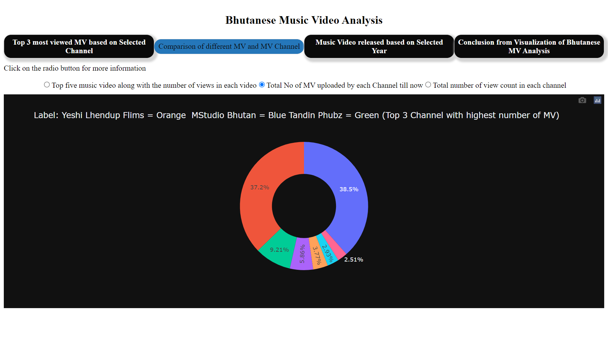
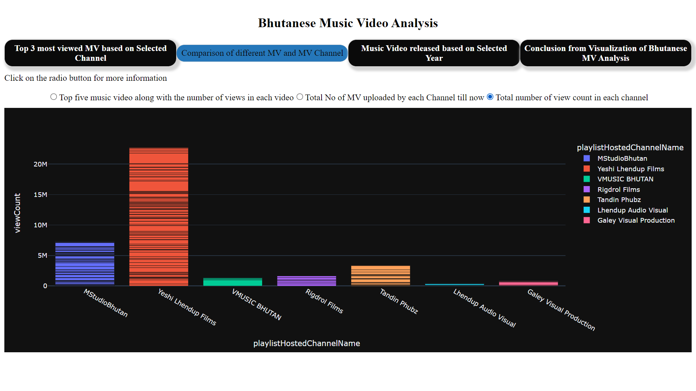
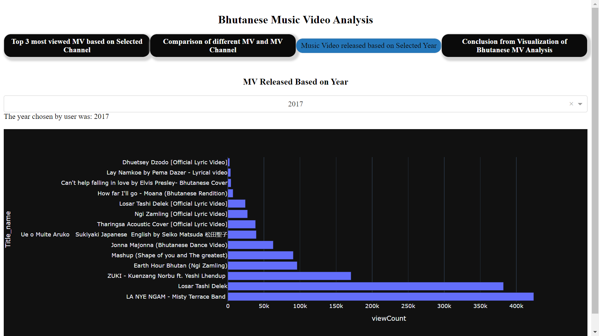
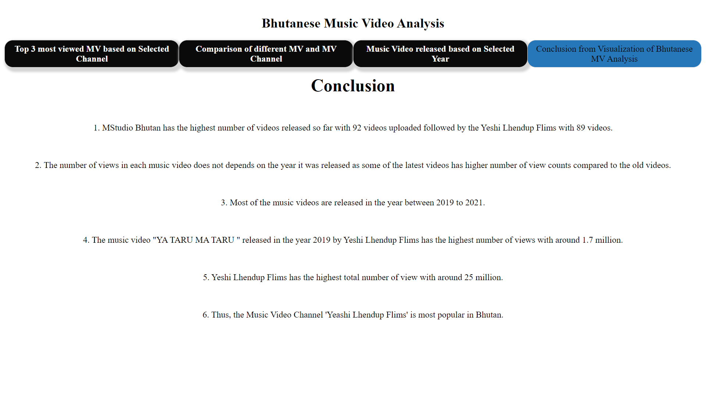

#MiniProject
<<<<<<< HEAD
#MiniProject

# Bhutanese Music Video Analysis

_Gyalpozhing College of Information
Technology(Bachelor of Science in Information
Technology(BScIT)) Year 3 (Data Analytics Module) Project_
=======

# Bhutanese Music Video Analysis

*Gyalpozhing College of Information 
Technology(Bachelor of Science in Information 
Technology(BScIT)) Year 3 (Data Analytics Module) Project*
>>>>>>> 8e5ee5c7cb7a3317b88f33f6fde64c9f7a197ca6

# Description

Among the various YouTube Channels in Bhutan, Music video or simply MV Channels are most
popular among the viewers in Bhutan. Not only Bhutan, some MV are also gaining international
viewers from all around the world. It is logical for any artist to be intrigued because of the
ongoing expansion of the video blogging culture. It helps those creator of Channels to meet new
people, reach wider audiences and earn money through creating exciting MVs.
Bhutan being the small country with less audience, it is import to be more creative
and productive to gain recognition from other countries. Music Video Analysis system is needed
so that it helps viewers to watch MV based on its popularity and be able to recommend it to others
thereby increasing the popularity of those MV. And not only this, it will help those MV creators
to analysis which type of MVs are most and least preferred and improve according to it.

# Technology Used
<<<<<<< HEAD

=======
>>>>>>> 8e5ee5c7cb7a3317b88f33f6fde64c9f7a197ca6
1. Visual Studio Code
2. Plotly Dash
3. Google Collab
4. Python

## Dashboard (Heroku Platform)
<<<<<<< HEAD

Click here :
(https://mini-prj.herokuapp.com/)

## Screenshoot of Bhutanese Music Video Analysis

=======
Click here : 
(https://mini-prj.herokuapp.com/)

## Screenshoot of Bhutanese Music Video Analysis
>>>>>>> 8e5ee5c7cb7a3317b88f33f6fde64c9f7a197ca6
  
  
  
  
  
  

# Conclusion

1. MStudio Bhutan has the highest number of videos released so far with 92 videos uploaded followed by the Yeshi Lhendup Flims with 89 videos.
2. The number of views in each music video does not depends on the year it was released as some of the latest videos has higher number of view counts compared to the old videos.
3. Most of the music videos are released in the year between 2019 to 2021.
4. The music video "YA TARU MA TARU " released in the year 2019 by Yeshi Lhendup Flims has the highest number of views with around 1.7 million.
5. Yeshi Lhendup Flims has the highest total number of view with around 25 million.
6. Thus, the Music Video Channel 'Yeashi Lhendup Flims' is most popular in Bhutan.
